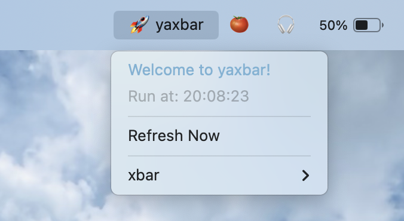

# YaxBar 🍸

> Put anything into your macOS menu bar. A modern, maintained fork of [xbar](https://github.com/matryer/xbar).



---

## Why YaxBar?

[xbar](https://github.com/matryer/xbar) (formerly BitBar) has long been one of the most versatile tools on macOS for putting custom scripts, feeds, and system stats directly into the menu bar.

However, upstream development stalled (with over 2 years of inactivity and ~180 open issues). In the modern era of agentic development, building tailored personal productivity tools has never been easier—and `xbar` represents the ideal canvas to tinker with.

When trying to set up a personalized Pomodoro timer, I ran into launch crashes on modern macOS. Upstream [Issue #950](https://github.com/matryer/xbar/issues/950) echoed the exact same frustration shared by many users whose menu bars broke on recent macOS releases.

I decided to dedicate time to revitalize the project:
- **Rock-solid macOS Stability:** Ensuring smooth, native execution on modern macOS (macOS 15 Sequoia and Apple Silicon `arm64`).
- **Seamless Backward Compatibility:** Existing `xbar` plugins and URL schemes (`xbar://`) continue to work alongside `YaxBar`.
- **Active Maintenance:** Dedicated focus on improving the core app experience.

---

## Installation

### Via Homebrew (Recommended)

```bash
brew install --cask envolt/tap/yaxbar
```

### Manual Download
Download the latest `yaxbar.<version>.dmg` directly from [GitHub Releases](https://github.com/enVolt/yaxbar/releases).

---

## Backward Compatibility with xbar

`YaxBar` is designed to be a drop-in upgrade:
- **Dual Plugin Support:** `YaxBar` automatically loads plugins from both directories:
  - `~/Library/Application Support/yaxbar/plugins` (Native)
  - `~/Library/Application Support/xbar/plugins` (Legacy xbar)
- **URL Scheme Support:** Handles both `yaxbar://` and `xbar://` links.
- **Plugin Protocol:** 100% compatible with BitBar/xbar scripts (shebang, intervals like `plugin.10s.sh`, `---` separators, and ANSI colors).

---

## Writing Plugins

Any executable script that outputs text to stdout can be a `YaxBar` plugin:

```bash
#!/bin/bash
# <xbar.title>Sample Plugin</xbar.title>
# <xbar.version>v1.0</xbar.version>

echo "☕️"
echo "---"
echo "Click to open GitHub | href=https://github.com/enVolt/yaxbar"
```

Name your script with a refresh interval (e.g. `pomodoro.10s.sh` or `weather.30m.py`), make it executable (`chmod +x`), and place it into your plugins folder.

---

## License

MIT License. Copyright (c) 2014-2023 Mat Ryer + contributors. Maintained & updated (c) 2026 Ashwani Agarwal.
